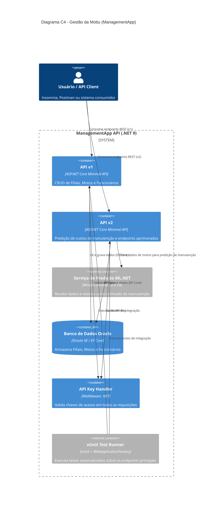

# Projeto de Gestão da Mottu

📌 Nota: Projeto desenvolvido para fins acadêmicos na disciplina de Advanced Business Development with .NET

Este sistema foi desenvolvido em ASP.NET Core Minimal API com o objetivo de centralizar o cadastro e gerenciamento de filiais, motos e funcionários da Mottu — permitindo operações completas de CRUD (criação, leitura, atualização e exclusão) de forma leve e padronizada.

A aplicação evoluiu significativamente em relação à sua primeira versão, incorporando novos recursos técnicos e boas práticas de arquitetura.

Abaixo estão destacados os componentes originais do projeto e as melhorias implementadas nesta nova versão:

🧩 **Recursos Existentes**

Na primeira versão, o foco foi consolidar a base estrutural da aplicação, garantindo estabilidade e boas práticas essenciais:
- 💾 Idempotência nas requisições POST, evitando duplicações acidentais.
- 🔁 Versionamento básico (v1), com suporte a endpoints organizados por grupo.
- ❤️ HealthChecks integrados ao banco Oracle, assegurando monitoramento e disponibilidade do sistema.

🚀 **Novos Recursos e Melhorias**

Nesta nova etapa, o sistema foi aprimorado com novas funcionalidades e aprimoramentos de segurança, testes e versionamento:
- 🧠 Predição de custos de manutenção de motos utilizando ML.NET, considerando quilometragem, tempo de uso e custo histórico.
- 🔁 Versionamento completo (v2) com utilização de headers (X-Api-Version) para selecionar a versão desejada e acessar endpoints atualizados.
- 🔒 Autenticação via API Key, exigida em todas as requisições, fortalecendo a segurança e controle de acesso.
- 🧪 Testes unitários e de integração para endpoints críticos (GET ALL, POST, DELETE de Filiais e POST de predição ML), garantindo maior qualidade e previsibilidade da aplicação.

## Índice
- [Integrantes](#integrantes)
- [Justificativas da Arquitetura](#justificativa-da-arquitetura)
- [Funcionalidades](#funcionalidades)
- [Como Rodar o Projeto](#como-rodar-o-projeto)
- [Efetuando Testes no Sistema](#efetuando-testes-no-sistema)
- [Fontes](#fontes)

## Integrantes
| Turma |    RM    |     Nome Completo     |
|:------|:--------:|:---------------------:|
| 2TDSB | RM555679 | Lavinia Soo Hyun Park |
| 2TDSB | RM559123 | Caroline de Oliveira  |
| 2TDSB | RM554473 | Giulia Corrêa Camillo |

## Justificativa da Arquitetura
A aplicação foi construída com base em uma estrutura **inspirada na Clean Architecture**, dividida em camadas independentes que garantem baixo acoplamento e alta coesão:

- **API Layer (`Endpoints/`)** → Interface pública da aplicação, responsável por expor os endpoints HTTP e agrupar operações por recurso, além de possuir validações básicas.
- **Domain Layer (`Models/`)** → Define as entidades principais (Filial, Moto, Funcionário) e suas propriedades.
- **Infrastructure Layer (`Infrastructure/`)** → Implementa a comunicação com o banco Oracle via Entity Framework Core e gerencia as migrations.
- **External Services** → Inclui o modelo de predição de manutenção via ML.NET e o monitoramento de disponibilidade via HealthChecks.
- **Test Layer (`ManagementApp.Tests/`)** → Projeto separado para execução de testes automatizados com xUnit e WebApplicationFactory.
> 🔍 **Observação:**  
> A aplicação adota uma estrutura simples, onde as validações básicas são realizadas diretamente nos endpoints, uma vez que não há interface de usuário nem lógica de negócio complexa.  
> A camada de infraestrutura concentra os middlewares e configurações globais (API Key, HealthChecks, Scalar, Versionamento), mantidas em arquivos auxiliares dentro de `Infrastructure/`, garantindo um `Program.cs` mais limpo e organizado.


O diagrama abaixo apresenta uma visão de alto nível da arquitetura e das interações entre suas camadas:


## Funcionalidades
- Cadastro completo de **filiais**, **motos** e **funcionários** (CRUD).
- Integração com o banco **Oracle** utilizando **Entity Framework Core**.
- Documentação da API interativa gerada automaticamente com **Scalar (OpenAPI)**.
- **Versionamento de API (v1 e v2)** com suporte a headers `X-Api-Version` para seleção de versão.
- **Idempotência** nas requisições `POST`, evitando operações duplicadas acidentais.
- **Autenticação via API Key**, exigida em todas as requisições da API.
- **Predição de custos de manutenção de motos** utilizando **ML.NET**, com base em quilometragem, tempo de uso e custo histórico.
- **HealthChecks** e monitoramento da conexão com o banco Oracle, garantindo disponibilidade e estabilidade.
- **Relacionamentos entre entidades** (ex.: motos vinculadas a uma filial; funcionário associado a uma filial).
- **Testes automatizados** com **xUnit** e **WebApplicationFactory** para endpoints principais.

## Como Rodar o Projeto
> ⚠️ **Importante:**  
> Clone este repositório antes de tudo!
> ```bash
> git clone [link-do-repositorio]
> ```
> Escolha a pasta desejada e abra o projeto na sua IDE de preferência
---
### 📜 1. Requisitos

| Ferramenta | Descrição | Download |
|-------------|------------|-----------|
|**.NET SDK 9.0** | Framework necessário para compilar e executar o projeto | [Baixar .NET SDK](https://dotnet.microsoft.com/en-us/download) |
|**Oracle XE** | Banco de dados local (ou utilize o da instituição) | [Baixar Oracle XE](https://www.oracle.com/database/technologies/appdev/xe.html) |
|**IDE** | Recomendado: Visual Studio, Rider ou VS Code | — |
|**API Client** | Testes realizados com **Insomnia**, mas funciona também no **Postman** ou outro de sua preferência | — |

---
### 🗄️ 2. Configuração da conexão com o Banco de Dados

No arquivo `appsettings.json`, configure sua conexão Oracle:

```
"ConnectionStrings": {
    "DefaultConnection": "Data Source=[ORACLE-URL]:1521/[ORACLE-HOST];User Id=[ORACLE-USER];Password=[ORACLE-PASSWORD]"
  }
```

> Substitua os valores entre colchetes `[ ]` conforme suas credenciais Oracle

### 🧠 **3. Executando o Projeto (CLI Mode)**

> 🖥️ Execute os comandos abaixo na raiz do projeto:

```bash
# 1. Restaurar dependências
dotnet restore

# 2. Aplicar migrations (cria as tabelas no Oracle)
 dotnet ef database update --project ManagementApp/ManagementApp.csproj 

# 3. Iniciar o servidor
dotnet run --project ManagementApp/ManagementApp.csproj
```

> 🔗 **URL gerada:** copie a exibida no console (exemplo: `http://localhost:5011`)

## **Efetuando Testes no Sistema**

### Visão Geral dos Endpoints

Abra a URL gerada pelo .NET e acesse o Scalar: `http://localhost:5011/scalar`

> 💡 **Dica:** No Scalar você pode visualizar todos os endpoints, métodos disponíveis e exemplos de requisição/retorno para cada entidade (Filiais, Motos, Funcionários e Predição de Custos)


---

### 1. Verificar Saúde do Sistema

O endpoint de Health Check confirma se a aplicação e o banco Oracle estão ativos: `http://localhost:5011/api/v2/health`


> ✅ Retorna “Healthy” quando o servidor e o banco estão funcionando corretamente

---

### 2. Executar Testes Unitários

Após verificar que o servidor está saudável, você pode rodar os **testes unitários** para validar a lógica principal da aplicação.

> 💡 **Os testes foram desenvolvidos utilizando o framework xUnit**, cobrindo os principais fluxos de CRUD e validações internas.

#### ▶️ Rodando os testes
Na raiz do projeto, execute o comando abaixo:

```bash
dotnet test
```

Isso irá:
- Restaurar automaticamente os pacotes necessários;
- Compilar o projeto e os testes;
- Executar todos os casos de teste definidos na pasta `ManagementApp.Tests`.

#### 📊 Resultados esperados
Ao final da execução, o terminal exibirá um resumo semelhante a:

```
Resumo do teste: total: 4; falhou: 0; bem-sucedido: 4; ignorado: 0; duração: 125,7s
```
> ✅ Se todos os testes passarem, significa que a lógica principal da API está funcionando conforme o esperado

### (Opcional) Executar Testes Manuais (API Client)

Nesta etapa, você pode testar os endpoints manualmente utilizando **Insomnia** ou **Postman**, seguindo o mesmo comportamento dos testes automatizados.

> 💡 **As requisições abaixo seguem o **versionamento v2** (`/api/v2`) e exigem os headers `X-API-Key` (utilize "pf1779" ou "rm555679") e `X-Api-Version`**

#### 1. **Verificar Registros Cadastrados (GET)**

Assim que a Migration for executada, o sistema já cria **10 registros iniciais** em cada tabela.  
Para listar, use: 

```
GET http://localhost:5011/api/v2/filiais?PageNumber=1&PageSize=2
```

> ⚙️ **Parâmetros:**
> - `PageNumber` = número da página (use `1` por padrão)
> - `PageSize` = quantidade de registros exibidos por página

📸 *Exemplo de headers e resposta paginada:*  


> 📑 O retorno é paginado e segue o padrão HATEOAS, incluindo links para navegação entre páginas e ações disponíveis.

---

#### 2. Buscar Registro Específico (GET by ID)
```
GET http://localhost:5011/api/v2/filiais/{id}
```
> 🔎 Substitua `{id}` por um ID retornado no GET anterior

📸 *Exemplo de headers e resposta com HATEOAS:* 


💡 **Dica:** O HATEOAS indica endpoints relacionados — como **GET by CNPJ**, **PUT** e **DELETE** — para facilitar a navegação.

---

#### 3. Cadastrar Novo Registro (POST)
```
POST http://localhost:5011/api/v2/filiais
```
> 🔑 Adicione o header:  
> `Idempotency-Key: <GUID único>`

📸 *Headers de exemplo:*  


🧩 *Exemplo de corpo JSON*
```json
{
	"nome": "Filial Lins",
	"cnpj": "45839432000145",
	"telefone": "(11) 3333-1089",
	"dataAbertura": "2017-09-02T00:00:00",
	"dataEncerramento": null,
	"endereco": {
		"cep": "01538-001",
		"logradouro": "Av. Lins de Vasconcelos",
		"numero": "1222",
		"complemento": null,
		"bairro": "Aclimação",
		"cidade": "São Paulo",
		"uf": "SP",
		"pais": "Brasil"
	}
}
```
📸 *Exemplo de resposta 201 (criação bem-sucedida):*


> ⚠️ ***Para Motos e Funcionários, inclua o campo `filialId` vinculado a uma filial existente***

---

#### 4. Atualizar Registro Existente (PUT)
```
PUT http://localhost:5011/api/v2/filiais/{id}
```
> ✏️ Copie o JSON atual e altere apenas os campos necessários (**não inclua o id na requisição**)

📸 *Exemplo de corpo e resposta:*


---

#### 5. Encerrar (Deletar) Registro (DELETE)
```
DELETE http://localhost:5011/api/v2/filiais/{id}/encerrar
```
> 🧹 Para Filiais, o endpoint específico de encerramento é `/encerrar`.
Consulte o Scalar para detalhes de cada entidade.

📸 *Exemplo de resposta de encerramento:*


> 💡 O DELETE de Filiais apenas encerra a empresa inserindo a data de encerramento, o método não apaga
a filial em si.

**✅ Resumo:**

Esses testes manuais permitem verificar cada operação CRUD,
validar cabeçalhos obrigatórios (`X-API-Key`, `Idempotency-Key`)
e observar o comportamento da API conforme o versionamento v2.

## Fontes

Paginação: https://osamadev.medium.com/implementing-pagination-in-net-api-a-simple-guide-fd7b85103739

HATEOAS: https://poornimanayar.co.uk/blog/minimal-apis-and-hateoas/